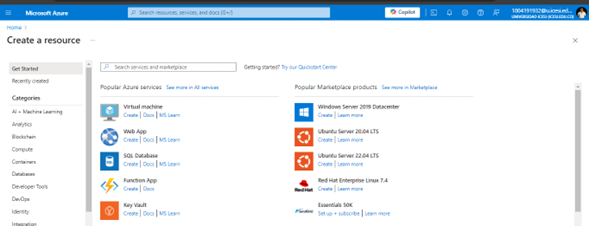

# Creación de una Máquina Virtual en Azure

En esta práctica se realizó la creación de una máquina virtual (VM) en Azure Cloud, incluyendo la configuración de la máquina virtual con Ubuntu 22.04.

## Requisitos Previos

Antes de comenzar, se debe de tener:

* Una cuenta activa en Microsoft Azure.

* Acceso al portal de Azure.

* Conocimientos básicos sobre la gestión de recursos en la nube.

## Pasos para la Creación de la Máquina Virtual

### Configuración Básica
1. Acceso a Azure Portal: se inició sesión en el portal de Azure.

2. Creación de una Máquina Virtual: Se seleccionó "Create a resource" y luego "Virtual Machine".

3. Configuración de la Máquina Virtual:

- Nombre de la VM: jorgejojoav1.

- Región: Usa la región más cercana o recomendada.

- Imagen: Selecciona Ubuntu 22.04 LTS.

- Tamaño: Standard B1s (1 vCPU, 1 GB de RAM).

## Architecture Overview

### Detalles de la Máquina Virtual

La VM fue configurada con las siguientes características:

- Nombre: jorgejojoav1

- Sistema Operativo: Ubuntu 22.04 LTS

- Tamaño: Standard B1s (1 vCPU, 1 GB de RAM)

- Dirección IP Pública: Configurada para acceder 
remotamente
- Estado: Running

- ID de la Suscripción: Visible en la captura de pantalla

### Configuración de Red
La configuración de red incluye:

- Red Virtual: Configuración de una red virtual predeterminada.

- Interfaz de Red: Con dirección IP privada asignada automáticamente.

- Reglas de Seguridad: Se establecen reglas para permitir el tráfico SSH a la máquina virtual.

### Revisión de Seguridad y Escalabilidad
- Grupos de Seguridad de Red: Se han configurado para permitir tráfico SSH desde cualquier ubicación.

- Auto-escalado: No configurado en esta VM, pero se puede configurar en Azure para escalar recursos según la demanda.

### Review de la máquina virtual
Finalmente, después de detallar todas las características necesarias, se creó la máquina virtual en azure. A continuación se presentan las imágenes de la práctica:

## Conclusión

Este taller proporcionó una guía paso a paso para la creación de una máquina virtual en Azure con Ubuntu 22.04, incluyendo la configuración de red, la asignación de recursos y la revisión de las características de seguridad. Esta práctica es esencial para familiarizarse con la administración de recursos en la nube utilizando Azure.
